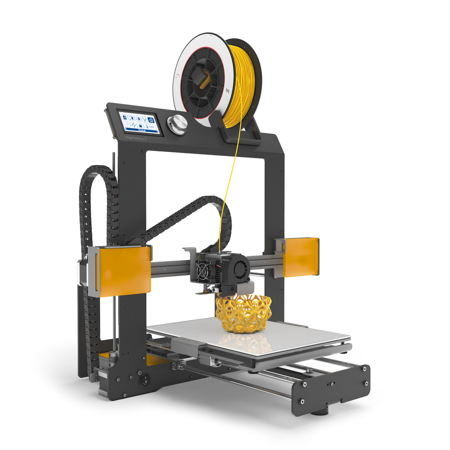

Hephestos 2
======

In this repository you will find the source files for the [bq Hephestos 2 3D printer](http://www.bq.com/es/productos/hephestos-2.html). If you are missing something, please do not hesitate to [file an issue on github](https://github.com/bq/hephestos-2/issues).

# License 

Hephestos 2 is licensed under a [Creative Commons Attribution-ShareAlike 4.0 International License](http://creativecommons.org/licenses/by-sa/4.0/)

Please read the LICENSE file for more details.

# Credits

 * Hephestos 2 is based on Prusa i3 Hephestos. Credit to the reprap community and specially to Josef Prusa.
 * Double Drive Gear Driven Filament extruder is inspired on several existing extruders:
    * PrintrBot Gear Head extruder by Brook Drumm [http://printrbot.com/shop/gear-head-extruder/] (http://printrbot.com/shop/gear-head-extruder/)
    * Bondtech extruder by Marting Bondéus [http://http://www.bondtech.se/] (http://www.bondtech.se/).
 * Electronics are designed from scratch by BQ hardware team and the base of knowledge from reprap community.

#Firmware
Firmware: [https://github.com/bq/Marlin](https://github.com/bq/Marlin)

Directory structure
===================

 * `Mechanical Design`: Hephestos 2 exported step file.

 * `Electronic Design`: Hephestos 2 Electronics BOM, Schematics and PCB files.

 * `Hephestos2-LOM.ods`: Hephestos 2 List of Materials. Document for [LibreOffice](https://www.libreoffice.org/).
 

